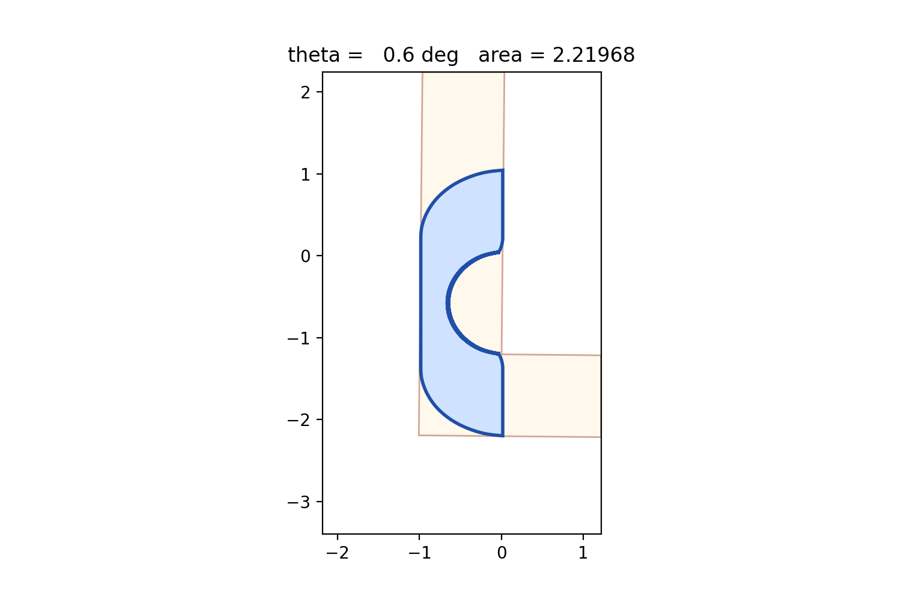
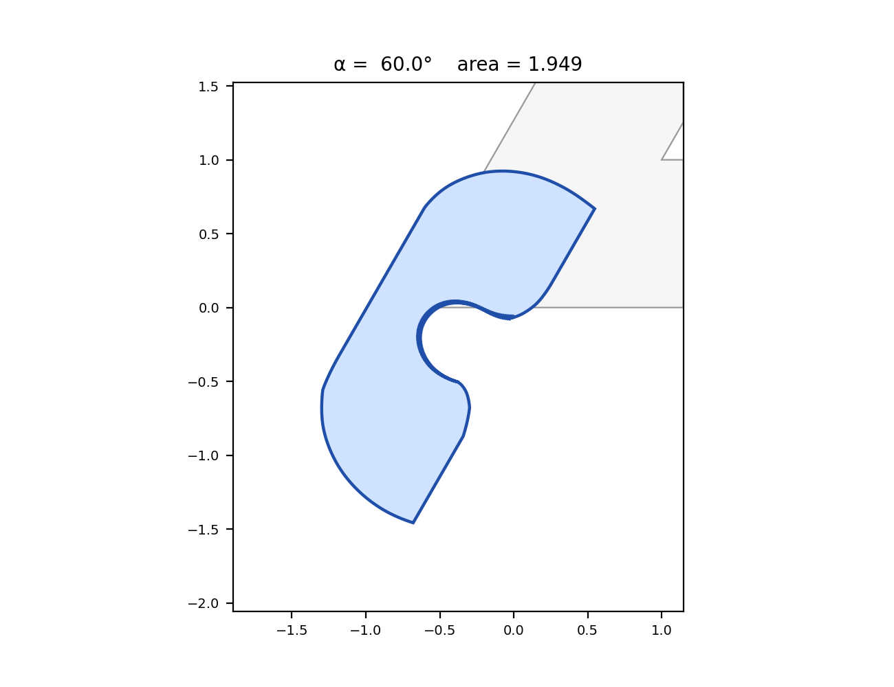

# The Moving Sofa Problem

Numerical optimisation of the **moving-sofa problem**: what is the largest
2-D shape that can navigate an L-shaped corridor of unit width while
making a 90° turn?

In 2-D the best-known lower bound is **Gerver's sofa**, area ≈ 2.21953.
The optimiser in this repo finds a Gerver-class shape with area
≈ 2.21968 (Nelder–Mead over a 10-control-point cubic-spline trajectory
of the inner corner).



The blue region is the sofa; the orange-shaded L is the corridor in the
sofa-fixed frame as it rotates from "fully in the horizontal arm" at
θ = 0° to "fully in the vertical arm" at θ = 90°. The dashed curve in
`sofa.png` is the trajectory of the L's inner corner that the optimiser
discovered.

## How it works

In the sofa-fixed frame, the L-corridor rotates and translates around
the sofa. For a chosen trajectory C(θ) of the inner corner, the largest
sofa that fits inside the corridor at every θ is

```
S(C) = intersection over theta in [0, pi/2] of  L(theta; C(theta))
```

We parameterise C(·) by a small number of cubic-spline control points
and maximise area(S(C)) with Nelder–Mead. With 10 control points and
100 θ samples for the polygon intersection, the search reproduces
Gerver's bound to four decimals in a few minutes.

## Reproducing the result

```
pip install numpy scipy shapely matplotlib
python3 sofa_pipeline.py
```

This produces `sofa.png`, `sofa.gif`, and prints the final area.

Files:

| file                | what it is                                                        |
|---------------------|-------------------------------------------------------------------|
| `sofa.py`           | core geometry + trajectory parameterisation                       |
| `optimize_sofa.py`  | Nelder–Mead driver with multi-round warm starts                   |
| `visualize.py`      | static plot and animation                                         |
| `sofa_pipeline.py`  | the same code, in one file, suitable for a notebook cell          |
| `sofa_angle.py`     | angle-aware version (corridor with bend angle α)                  |
| `sweep_angles_cascade.py` | runs the 7-angle sweep with warm-starting                 |
| `visualize_sweep.py`| builds `sweep_static.png` and `sweep.gif`                         |
| `Wolfram/community/`| Wolfram Language port + Wolfram Community post                    |

## Varying the bend angle

Generalises the 90° L to corridor bend angle α ∈ (0°, 180°). For α close
to 180° the corridor straightens into a strip (the sofa is unbounded);
for α close to 0° the corridor folds back and the sofa pinches.



The seven anchor angles (60°, 75°, 90°, 105°, 120°, 135°, 150°) are
each Nelder–Mead optima with the previous anchor warm-starting the next,
which is essential at high α where the cold-start optimiser
otherwise traps in a thin-strip local optimum.
