```wl
In[]:= reg = RegionUnion[DiscretizeGraphics[Graphics@Rectangle[{-5, -1}, {2, 1}]], DiscretizeGraphics[Graphics@Rectangle[{0, -1}, {2, -6}]], AspectRatio -> 1]
```

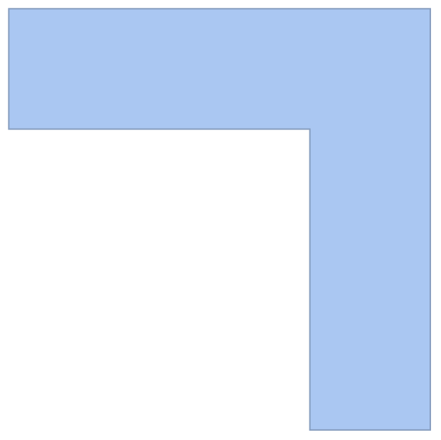

```wl
In[]:= Manipulate[RegionIntersection[reg, TransformedRegion[TransformedRegion[reg, TranslationTransform[{x, 0}]],RotationTransform[alpha, {0, -1}]], PlotRange -> {{-6, 6}, {-6, 6}}], {x, 0, 2}, {alpha, 0, 2 Pi}]
```

MarkdownTools`Private`ExportAnimatedImage[-AnimatedImage-, {GeneratedAssetLocation -> /Users/thiel/GitHub/SofaProblem/img/, WolframLanguageTag -> wl}]


```wl
In[]:= Manipulate[RegionPlot[{reg, TransformedRegion[TransformedRegion[reg, TranslationTransform[{x, 0}]], RotationTransform[-alpha, {0, -1}]]}, PlotRange -> {{-6, 6}, {-6, 6}}], {x, 0, 2}, {alpha, 0, 2 Pi}]
```

MarkdownTools`Private`ExportAnimatedImage[-AnimatedImage-, {GeneratedAssetLocation -> /Users/thiel/GitHub/SofaProblem/img/, WolframLanguageTag -> wl}]


```wl
In[]:= Manipulate[RegionPlot[{reg, TransformedRegion[TransformedRegion[reg, TranslationTransform[{-2 Cos[alpha] + 1, -1 + 2 Cos[alpha]}]], RotationTransform[-alpha + Pi/4, {0, -1}]]}, PlotRange -> {{-6, 6}, {-6, 6}}], {alpha, 0, Pi/2}]
```

MarkdownTools`Private`ExportAnimatedImage[-AnimatedImage-, {GeneratedAssetLocation -> /Users/thiel/GitHub/SofaProblem/img/, WolframLanguageTag -> wl}]

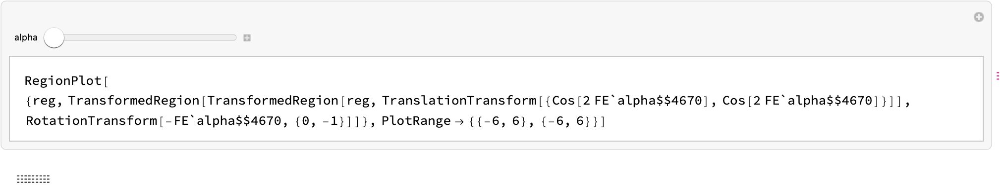

```wl
In[]:= \[AliasDelimiter]\[AliasDelimiter]
```

```wl
In[]:= TransformedRegion[reg, RotationTransform[2.]]
```

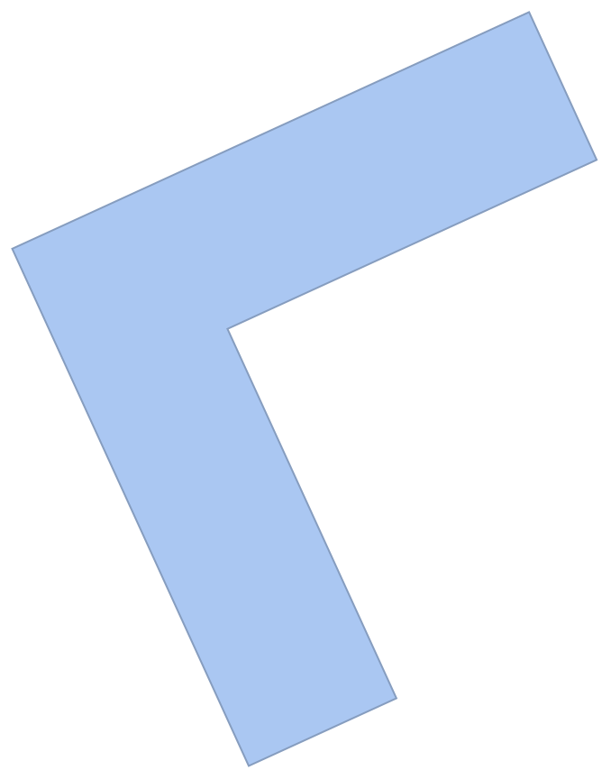

```wl
In[]:= RegionIntersection[reg, TransformedRegion[TransformedRegion[reg, TranslationTransform[{x, 0}]],RotationTransform[alpha]]]
```

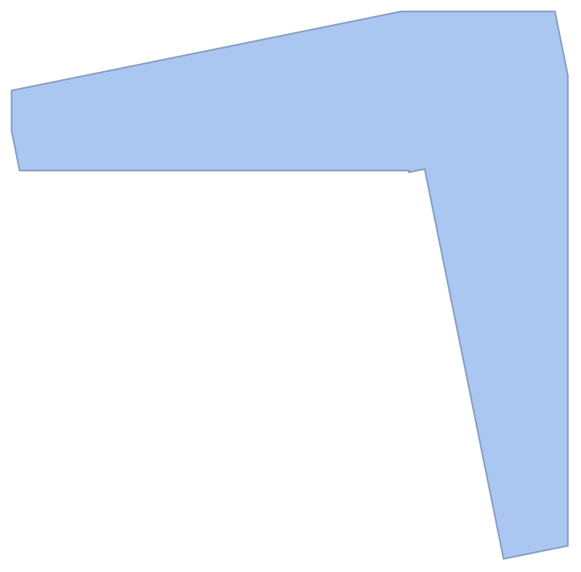

```wl
In[]:= ListLinePlot[Table[{1. Cos[k alpha], 1. Sin[k alpha]} /. k -> 2., {alpha, -Pi/4, Pi/4, (Pi/2.)/100.}], AspectRatio -> 1]
```

```wl
In[]:= 
```

```wl
In[]:= regs = Flatten[Table[TransformedRegion[TransformedRegion[reg, TranslationTransform[{0.01 Cos[k alpha], 0.01 Sin[k alpha]}]], RotationTransform[-alpha, {0, -1}]], {alpha, 0, Pi/2., (Pi/2.)/10.}, {k, 1, 9}]];
```

```wl
In[]:= regs
```

```wl
In[]:= Fold[RegionIntersection, regs]
```

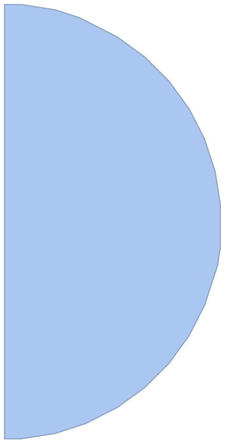

```wl
In[]:= \[AliasDelimiter]\[AliasDelimiter]
```

```wl
In[]:= RegionIntersection @@ Table[TransformedRegion[TransformedRegion[reg, TranslationTransform[{Cos[10 alpha], Sin[10 alpha]}]], RotationTransform[0.1*alpha]], {alpha, 0, Pi/2., 0.1}]
```

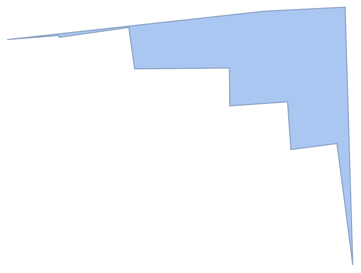

```wl
In[]:= (*Alpha needs to go from 0,Pi/2*)
```

```wl
In[]:= ListLinePlot[Accumulate@Table[{2/100. Cos[k alpha], 2/100. Sin[k alpha]} /. alpha -> 0.6, {k, 1, 100, 1}], AspectRatio -> 1]
```

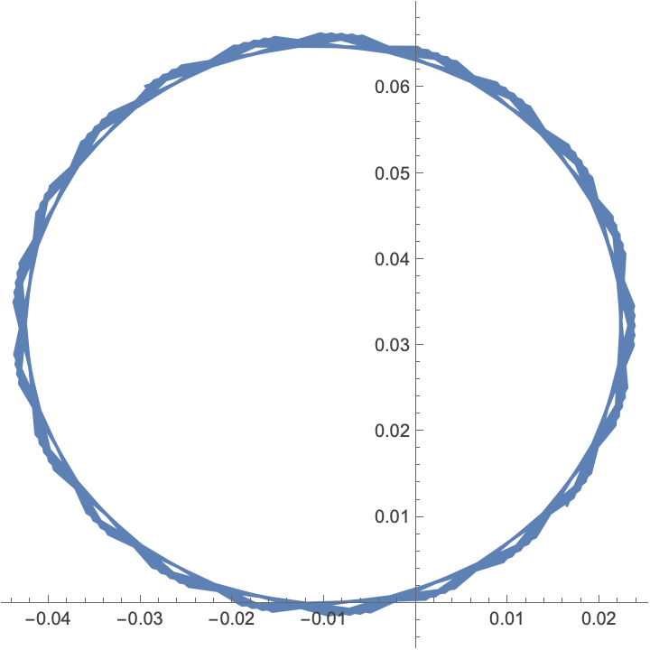

```wl
In[]:= ListPlot[Table[{-1 Cos[alpha], 1}, {alpha, 0, Pi/2.}]]
```

```wl
In[]:= {-1, 1}, {1, -1}
```

```wl
In[]:= Plot[{-Cos[2 alpha], Cos[2 alpha]}, {alpha, 0, Pi/2}, AspectRatio -> 1]
```


```wl
In[]:= Plot[{-2 Cos[alpha] + 1, -1 + 2 Cos[alpha]}, {alpha, 0, Pi/2}, AspectRatio -> 1]
```

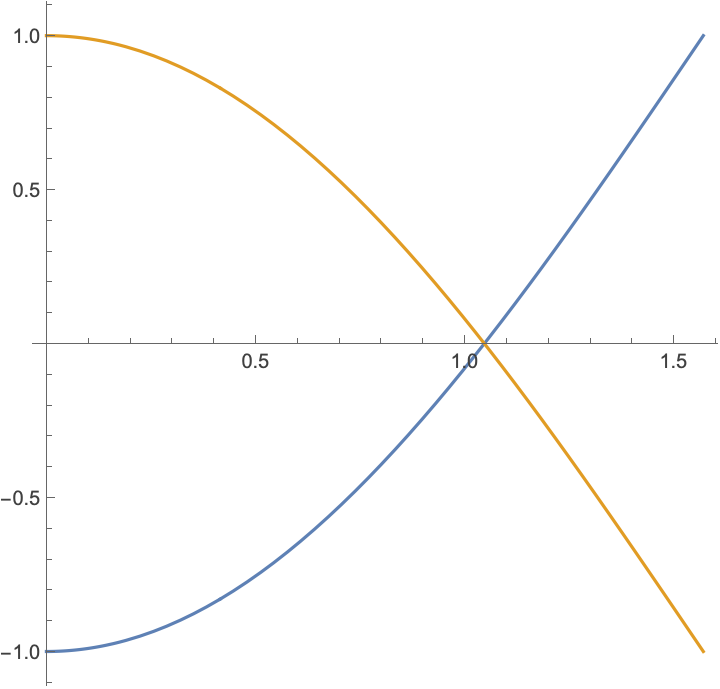

```wl
In[]:= Plot[{-Cos[2 alpha], Cos[2 alpha]}, {alpha, 0, Pi/2}, AspectRatio -> 1]
```

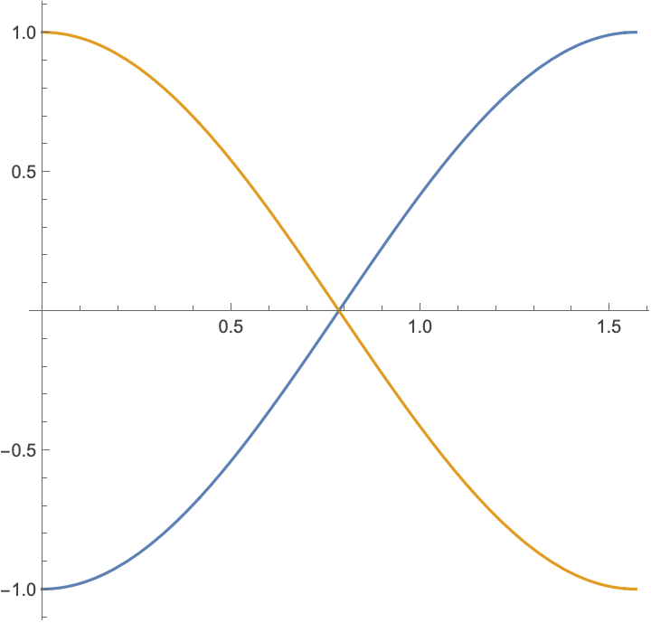

```wl
In[]:= regs = Table[TransformedRegion[TransformedRegion[reg, TranslationTransform[{-2 Cos[alpha] + 1, -1 + 2 Cos[alpha]}]], RotationTransform[-alpha, {0, -1}]], {alpha, 0, Pi/2, 0.03}];
```

```wl
In[]:= regs = Table[TransformedRegion[TransformedRegion[reg, TranslationTransform[{-Cos[2 alpha], Cos[2 alpha]}]], RotationTransform[-alpha, {0, -1}]], {alpha, 0, Pi/2, 0.02}];
```

```wl
In[]:= Fold[RegionIntersection, regs]
```

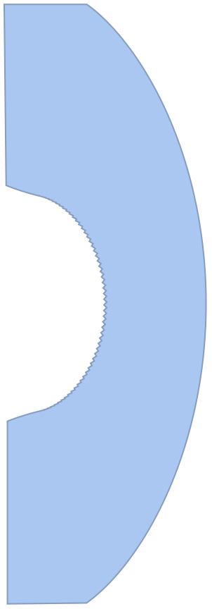

```wl
In[]:= Area[%]
```

```wl
Out[]= 8.18185
```

```wl
In[]:= %/4
```

```wl
Out[]= 2.04546
```

```wl
In[]:= regs = Table[TransformedRegion[TransformedRegion[reg, TranslationTransform[{-0.9 Cos[2 alpha], 0.9 Cos[2 alpha]}]], RotationTransform[-alpha, {0, -1}]], {alpha, 0, Pi/2, 0.02}];
```

```wl
In[]:= Fold[RegionIntersection, regs]
```

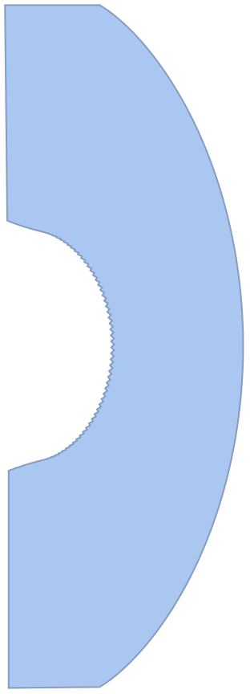

```wl
In[]:= Area[%]
```

```wl
Out[]= 8.18533
```

```wl
In[]:= Plot[{-1 Sign[Cos[2 alpha]] Abs[Cos[2 alpha]]^0.5, 1 Sign[Cos[2 alpha]] Abs[Cos[2 alpha]]^0.5}, {alpha, 0, Pi/2}]
```

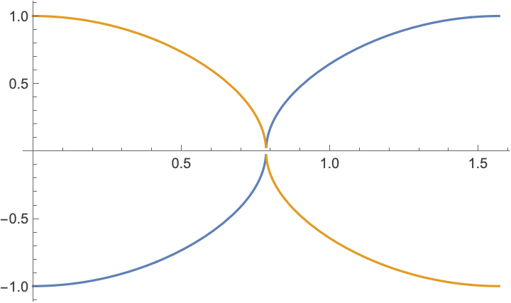

```wl
In[]:= regs = Table[TransformedRegion[TransformedRegion[reg, TranslationTransform[{-1 Sign[Cos[2 alpha]] Abs[Cos[2 alpha]]^1.1, 1 Sign[Cos[2 alpha]] Abs[Cos[2 alpha]]^1.1}]], RotationTransform[-alpha, {0, -1}]], {alpha, 0, Pi/2, 0.02}];
```

```wl
In[]:= Fold[RegionIntersection, regs]
```

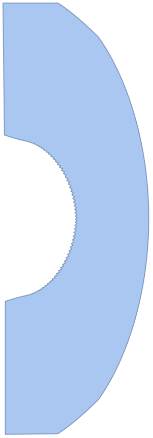

```wl
In[]:= Area[%]
```

```wl
Out[]= 8.28222
```

```wl
In[]:= %/4
```

```wl
Out[]= 2.07055
```

```wl
In[]:= regs = Table[TransformedRegion[TransformedRegion[reg, TranslationTransform[{-1.04 Sign[Cos[2 alpha]] Abs[Cos[2 alpha]]^1.1, 1 Sign[Cos[2 alpha]] Abs[Cos[2 alpha]]^1.1}]], RotationTransform[-alpha, {0, -1}]], {alpha, 0, Pi/2, 0.02}];
```

```wl
In[]:= Fold[RegionIntersection, regs]
```

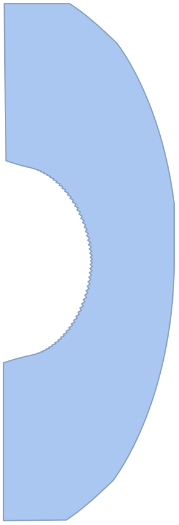

```wl
In[]:= Area[%]
```

```wl
Out[]= 8.26161
```

```wl
In[]:= regs // Length
```

```wl
Out[]= 79
```

```wl
In[]:= FoldList[RegionIntersection, regs[[1 ;; 79]]]
```

```wl
In[]:= reg = RegionUnion[DiscretizeGraphics[Graphics@Rectangle[{-7, -1}, {2, 1}]], DiscretizeGraphics[Graphics@Rectangle[{0, -1}, {2, -8}]], AspectRatio -> 1]
```

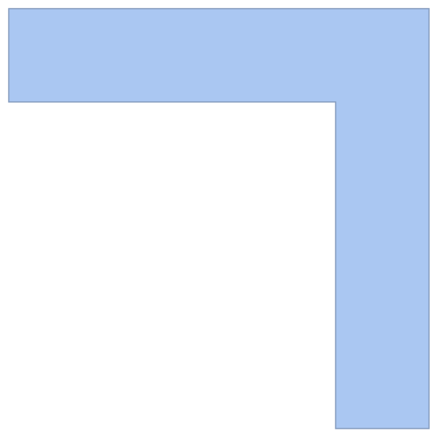

```wl
In[]:= regs = Table[TransformedRegion[TransformedRegion[reg, TranslationTransform[{-1 Sign[Cos[2 alpha]] Abs[Cos[2 alpha]]^1.1, 1 Sign[Cos[2 alpha]] Abs[Cos[2 alpha]]^1.1}]], RotationTransform[-alpha, {0, -1}]], {alpha, 0, Pi/2, 0.02}];
```

```wl
In[]:= FoldList[RegionIntersection, regs]
```

```wl
In[]:= Manipulate[RegionPlot[{reg, TransformedRegion[TransformedRegion[reg, TranslationTransform[{-1 Sign[Cos[2 alpha]] Abs[Cos[2 alpha]]^1, 1 Sign[Cos[2 alpha]] Abs[Cos[2 alpha]]^1}]], RotationTransform[-alpha + Pi/4., {0, -1}]]}, PlotRange -> {{-10, 10}, {-10, 10}}], {alpha, 0, Pi/2}]
```

MarkdownTools`Private`ExportAnimatedImage[-AnimatedImage-, {GeneratedAssetLocation -> /Users/thiel/GitHub/SofaProblem/img/, WolframLanguageTag -> wl}]

```wl
In[]:= Plot[{-alpha + Pi/4, Sign[-alpha + Pi/4.] Sqrt[Abs[(-alpha + Pi/4.)]*4/Pi]*Pi/4.}, {alpha, 0, Pi/2}]
```

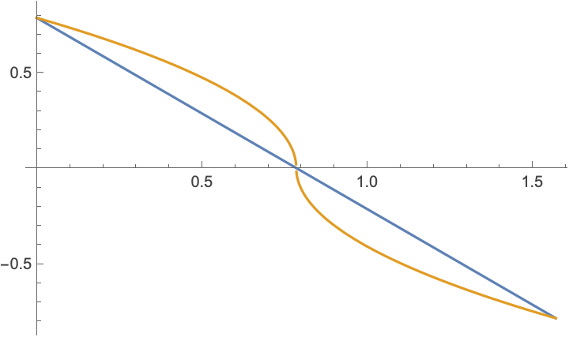

```wl
In[]:= Manipulate[RegionPlot[{reg, TransformedRegion[TransformedRegion[reg, TranslationTransform[{-1 Sign[Cos[2 alpha]] Abs[Cos[2 alpha]]^1, 1 Sign[Cos[2 alpha]] Abs[Cos[2 alpha]]^1}]], RotationTransform[Sign[-alpha + Pi/4.] Sqrt[Abs[(-alpha + Pi/4.)]*4/Pi]*Pi/4., {0, -1}]]}, PlotRange -> {{-10, 10}, {-10, 10}}], {alpha, 0, Pi/2}]
```

MarkdownTools`Private`ExportAnimatedImage[-AnimatedImage-, {GeneratedAssetLocation -> /Users/thiel/GitHub/SofaProblem/img/, WolframLanguageTag -> wl}]

```wl
In[]:= regs = Table[TransformedRegion[TransformedRegion[reg, TranslationTransform[{-1 Sign[Cos[2 alpha]] Abs[Cos[2 alpha]]^1, 1 Sign[Cos[2 alpha]] Abs[Cos[2 alpha]]^1}]], RotationTransform[Sign[-alpha + Pi/4.] (Abs[(-alpha + Pi/4.)]*4/Pi)^0.6*Pi/4., {0, -1}]], {alpha, 0, Pi/2, 0.02}];
```

```wl
In[]:= Fold[RegionIntersection, regs]
```

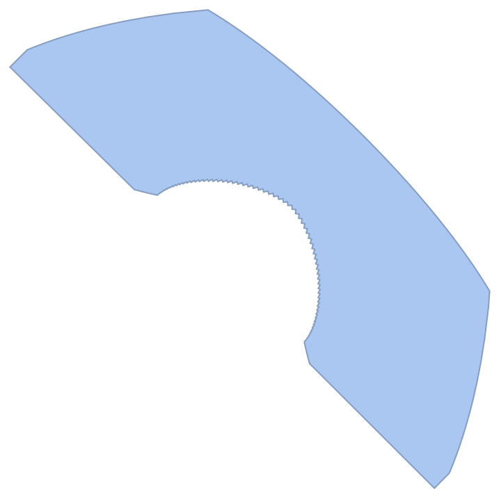

```wl
In[]:= Area[%]
```

```wl
Out[]= 8.40544
```

```wl
In[]:= %/4
```

```wl
Out[]= 2.10136
```

```wl
In[]:= regs = Table[TransformedRegion[TransformedRegion[reg, TranslationTransform[{-1.05 Sign[Cos[2 alpha]] Abs[Cos[2 alpha]]^1, 1.05 Sign[Cos[2 alpha]] Abs[Cos[2 alpha]]^1}]], RotationTransform[Sign[-alpha + Pi/4.] (Abs[(-alpha + Pi/4.)]*4/Pi)^0.6*Pi/4., {0, -1}]], {alpha, 0, Pi/2, 0.02}];
```

```wl
In[]:= Fold[RegionIntersection, regs]
```

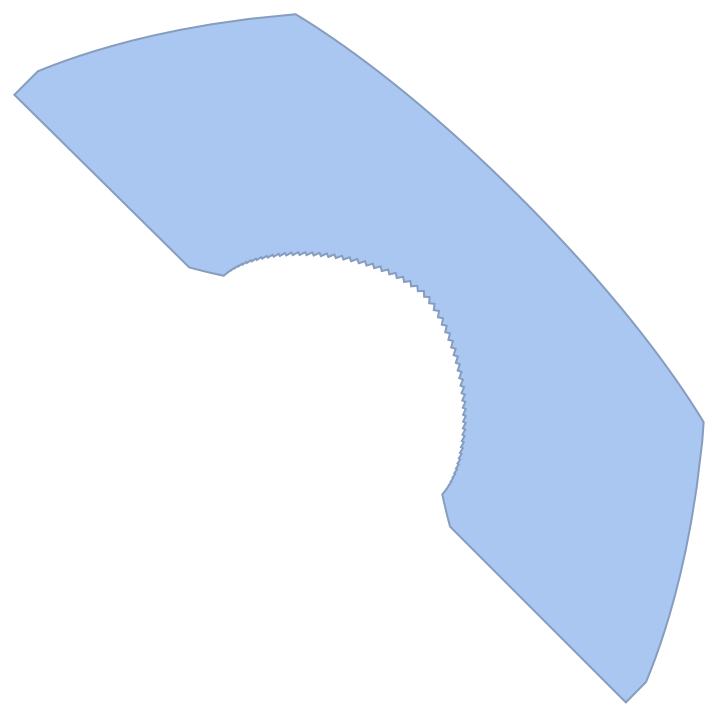

```wl
In[]:= Area[%]
```

```wl
Out[]= 8.41839
```

```wl
In[]:= regs = Table[TransformedRegion[TransformedRegion[reg, TranslationTransform[{-1.01 Sign[Cos[2 alpha]] Abs[Cos[2 alpha]]^1, 1.01 Sign[Cos[2 alpha]] Abs[Cos[2 alpha]]^1}]], RotationTransform[Sign[-alpha + Pi/4.] (Abs[(-alpha + Pi/4.)]*4/Pi)^0.66*Pi/4., {0, -1}]], {alpha, 0, Pi/2, 0.02}];
```

```wl
In[]:= Fold[RegionIntersection, regs]
```

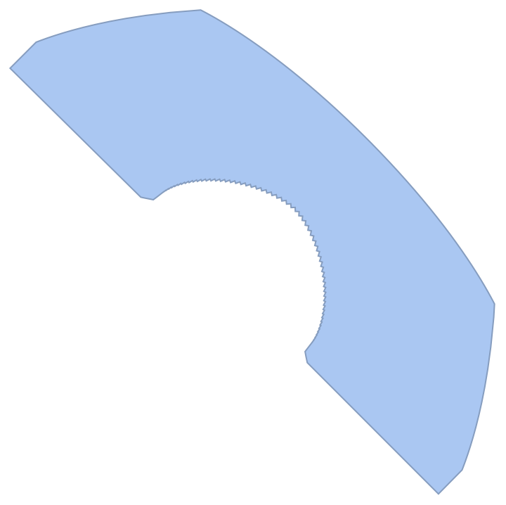

```wl
In[]:= Area[%658]
```

```wl
Out[]= 8.45864
```

```wl
In[]:= regs = Table[TransformedRegion[TransformedRegion[reg, TranslationTransform[{-1.01 Sign[Cos[2 alpha]] Abs[Cos[2 alpha]]^0.98, 1.01 Sign[Cos[2 alpha]] Abs[Cos[2 alpha]]^0.98}]], RotationTransform[Sign[-alpha + Pi/4.] (Abs[(-alpha + Pi/4.)]*4/Pi)^0.66*Pi/4., {0, -1}]], {alpha, 0, Pi/2, 0.02}];
```

```wl
In[]:= Fold[RegionIntersection, regs]
```


```wl
In[]:= Area[%]
```

```wl
Out[]= 8.46654
```

```wl
In[]:= regs = Table[TransformedRegion[TransformedRegion[reg, TranslationTransform[{-1.01 Sign[Cos[2 alpha]] Abs[Cos[2 alpha]]^0.94, 1.01 Sign[Cos[2 alpha]] Abs[Cos[2 alpha]]^0.94}]], RotationTransform[Sign[-alpha + Pi/4.] (Abs[(-alpha + Pi/4.)]*4/Pi)^0.66*Pi/4., {0, -1}]], {alpha, 0, Pi/2, 0.02}];
```

```wl
In[]:= Fold[RegionIntersection, regs]
```


```wl
In[]:= Area[%]
```

```wl
Out[]= 8.47997
```

```wl
In[]:= regs = Table[TransformedRegion[TransformedRegion[reg, TranslationTransform[{-1.01 Sign[Cos[2 alpha]] Abs[Cos[2 alpha]]^0.9, 1.01 Sign[Cos[2 alpha]] Abs[Cos[2 alpha]]^0.9}]], RotationTransform[Sign[-alpha + Pi/4.] (Abs[(-alpha + Pi/4.)]*4/Pi)^0.66*Pi/4., {0, -1}]], {alpha, 0, Pi/2, 0.02}];
```

```wl
In[]:= Fold[RegionIntersection, regs]
```


```wl
In[]:= Area[%]
```

```wl
Out[]= 8.4896
```

```wl
In[]:= regs = Table[TransformedRegion[TransformedRegion[reg, TranslationTransform[{-1.01 Sign[Cos[2 alpha]] Abs[Cos[2 alpha]]^0.8, 1.01 Sign[Cos[2 alpha]] Abs[Cos[2 alpha]]^0.8}]], RotationTransform[Sign[-alpha + Pi/4.] (Abs[(-alpha + Pi/4.)]*4/Pi)^0.66*Pi/4., {0, -1}]], {alpha, 0, Pi/2, 0.02}];
```

```wl
In[]:= Fold[RegionIntersection, regs]
```


```wl
In[]:= Area[%]
```

```wl
Out[]= 8.49304
```

```wl
In[]:= regs = Table[TransformedRegion[TransformedRegion[reg, TranslationTransform[{-1.01 Sign[Cos[2 alpha]] Abs[Cos[2 alpha]]^0.8, 1.01 Sign[Cos[2 alpha]] Abs[Cos[2 alpha]]^0.8}]], RotationTransform[Sign[-alpha + Pi/4.] (Abs[(-alpha + Pi/4.)]*4/Pi)^0.63*Pi/4., {0, -1}]], {alpha, 0, Pi/2, 0.015}];
```

```wl
In[]:= Fold[RegionIntersection, regs]
```

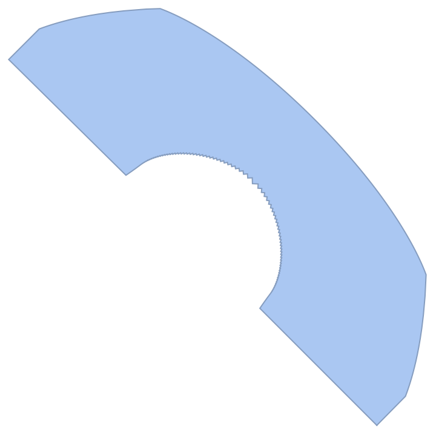

```wl
In[]:= Area[%]
```

```wl
Out[]= 8.49835
```

```wl
In[]:= regs = Table[TransformedRegion[TransformedRegion[reg, TranslationTransform[{-1.01 Sign[Cos[2 alpha]] Abs[Cos[2 alpha]]^0.8, 1.01 Sign[Cos[2 alpha]] Abs[Cos[2 alpha]]^0.8}]], RotationTransform[Sign[-alpha + Pi/4.] (Abs[(-alpha + Pi/4.)]*4/Pi)^0.6*Pi/4., {0, -1}]], {alpha, 0, Pi/2, 0.015}];
```

```wl
In[]:= Fold[RegionIntersection, regs]
```


```wl
In[]:= Area[%]
```

```wl
Out[]= 8.50305
```

```wl
In[]:= %/4.
```

```wl
Out[]= 2.12576
```

```wl
In[]:= regs = Table[TransformedRegion[TransformedRegion[reg, TranslationTransform[{-1.2 Sign[Cos[2 alpha]] Abs[Cos[2 alpha]]^0.7, 1.2 Sign[Cos[2 alpha]] Abs[Cos[2 alpha]]^0.7}]], RotationTransform[Sign[-alpha + Pi/4.] (Abs[(-alpha + Pi/4.)]*4/Pi)^0.53*Pi/4., {0, -1}]], {alpha, 0, Pi/2, 0.015}];
```

```wl
In[]:= Fold[RegionIntersection, regs]
```

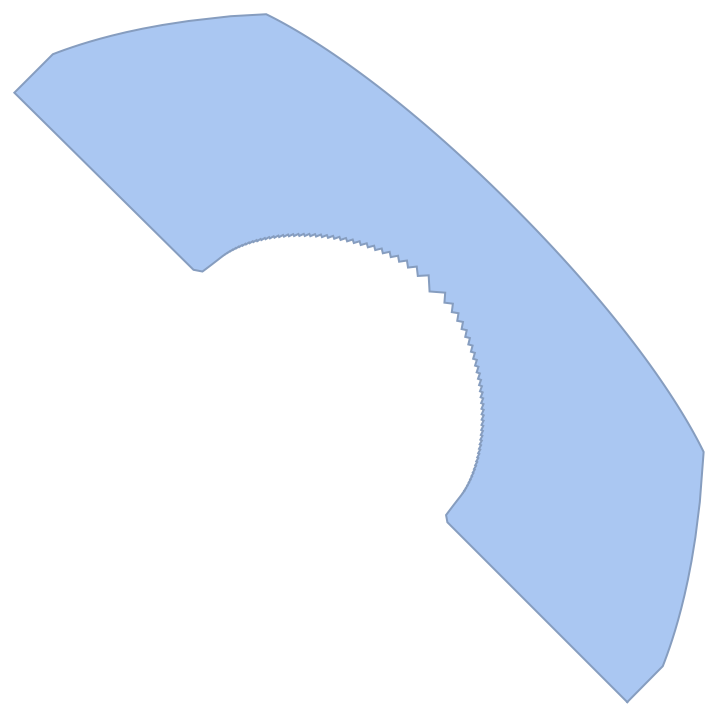

```wl
In[]:= Area[%]
```

```wl
Out[]= 8.55506
```

```wl
In[]:= regs = Table[TransformedRegion[TransformedRegion[reg, TranslationTransform[{-1.225 Sign[Cos[2 alpha]] Abs[Cos[2 alpha]]^0.68, 1.225 Sign[Cos[2 alpha]] Abs[Cos[2 alpha]]^0.68}]], RotationTransform[Sign[-alpha + Pi/4.] (Abs[(-alpha + Pi/4.)]*4/Pi)^0.53*Pi/4., {0, -1}]], {alpha, 0, Pi/2, 0.015}];
```

```wl
In[]:= Fold[RegionIntersection, regs]
```

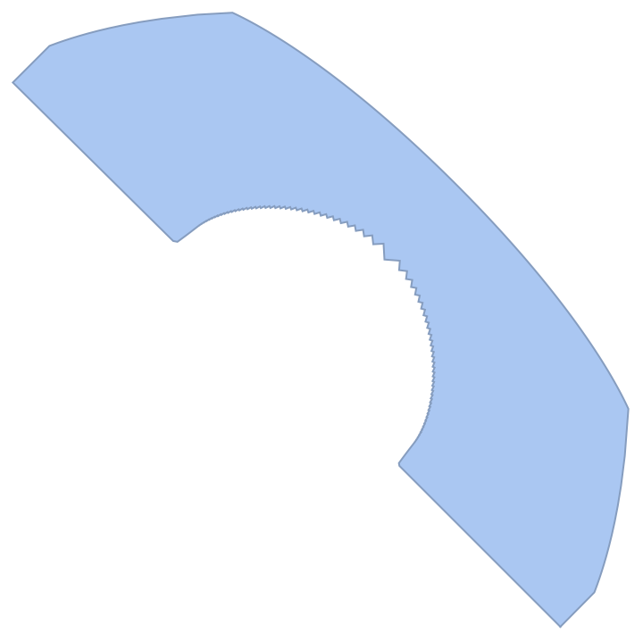

```wl
In[]:= Area[%]
```

```wl
Out[]= 8.55843
```

```wl
In[]:= regs = Table[TransformedRegion[TransformedRegion[reg, TranslationTransform[{-1.225 Sign[Cos[2 alpha]] Abs[Cos[2 alpha]]^0.68, 1.225 Sign[Cos[2 alpha]] Abs[Cos[2 alpha]]^0.68}]], RotationTransform[Sign[-alpha + Pi/4.] (Abs[(-alpha + Pi/4.)]*4/Pi)^0.52*Pi/4., {0, -1}]], {alpha, 0, Pi/2, 0.015}];
```

```wl
In[]:= Fold[RegionIntersection, regs]
```


```wl
In[]:= Area[%]
```

```wl
Out[]= 8.5583
```

```wl
In[]:= %/4.
```

```wl
Out[]= 2.13957
```

```wl
In[]:= regs = Table[TransformedRegion[TransformedRegion[reg, TranslationTransform[{-1.225 Sign[Cos[2 alpha]] Abs[Cos[2 alpha]]^0.68, 1.225 Sign[Cos[2 alpha]] Abs[Cos[2 alpha]]^0.68}]], RotationTransform[Sign[-alpha + Pi/4.] (Abs[(-alpha + Pi/4.)]*4/Pi)^0.52*Pi/4., {0, -1}]], {alpha, 0, Pi/2, 0.01}];
```

```wl
In[]:= Fold[RegionIntersection, regs]
```

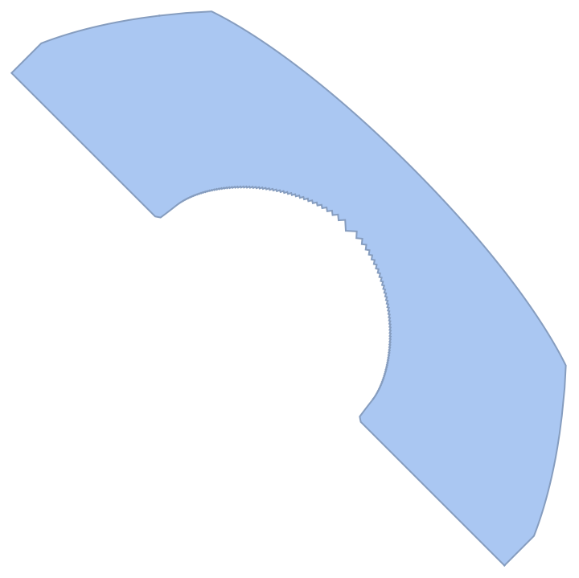

```wl
In[]:= Area[%]
```

```wl
Out[]= 8.51918
```

```wl
In[]:= %/4.
```

```wl
Out[]= 2.1298
```

```wl
In[]:= Plot[{-1.225 Sign[Cos[2 alpha]] Abs[Cos[2 alpha]]^0.68, 1.225 Sign[Cos[2 alpha]] Abs[Cos[2 alpha]]^0.68}, {alpha, 0, Pi/2.}]
```

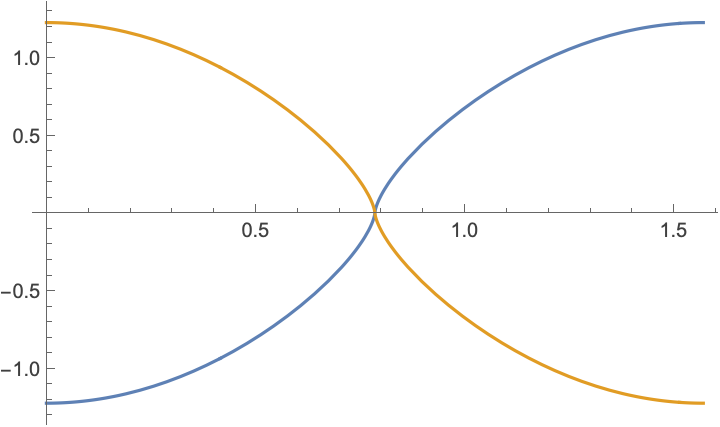

```wl
In[]:= \[AliasDelimiter]
```

```wl
In[]:= Plot[Sign[-alpha + Pi/4.] (Abs[(-alpha + Pi/4.)]*4/Pi)^0.52*Pi/4., {alpha, 0, Pi/2.}]
```

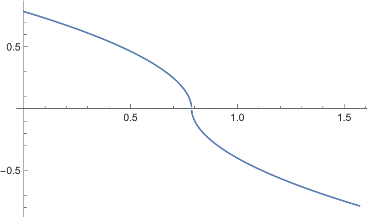

```wl
In[]:= NMaximize
```

```wl
In[]:= results = {}; Monitor[Table[regs = Table[TransformedRegion[TransformedRegion[reg, TranslationTransform[{-amp Sign[Cos[2 alpha]] Abs[Cos[2 alpha]]^exp1, amp Sign[Cos[2 alpha]] Abs[Cos[2 alpha]]^exp1}]], RotationTransform[Sign[-alpha + Pi/4.] (Abs[(-alpha + Pi/4.)]*4/Pi)^exp2*Pi/4., {0, -1}]], {alpha, 0, Pi/2, 0.015}]; AppendTo[results, {amp, exp1, exp2, Area[Fold[RegionIntersection, regs]]}];Export["~/Desktop/results.mx", results], {amp, 1.1, 1.6, 0.1}, {exp1, 0.55, 0.7, 0.03}, {exp2, 0.45, 0.6, 0.03}];, {amp, exp1, exp2}]
```

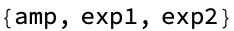